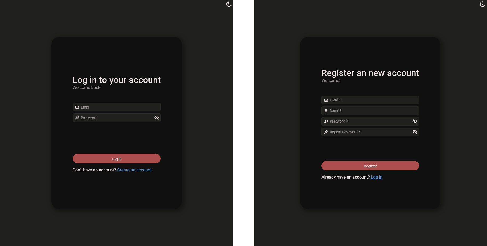
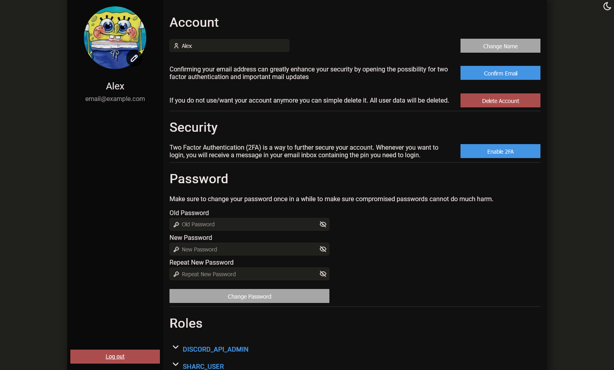
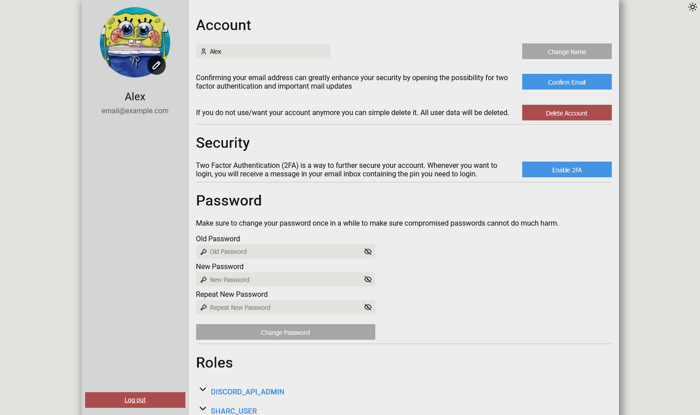
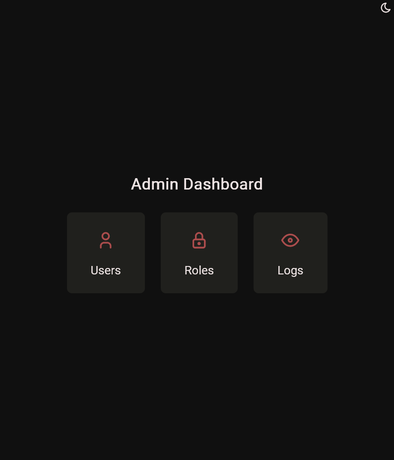

# Identity Server
Centralized selfhosted OAuth provider that manages users, roles and authentication tokens.
> No need to have a custom authentication and user database in all of your projects or services.

## How it works
Just run this service in a docker container and configure it as your authentication route.

When your service asks for authentication, the user gets redirected to `/auth/login` to authenticate. Then a cookie gets set and the user is redirected back to your service.

> [!WARNING]
> The services must run under the same domain as the identity server. The cookie gets set to the domain of the identity server by default. (e.g. `identity-server.example.com` sets an authentication cookie for `.example.com`)

## Features

#### User Login and Register forms
>Intuitive UI for the users to login or to create a new account

#### User profile
>Extensive user profile displaying all information about the user and giving the ability to do some operations as:
>- Change profile picture
>- Change name
>- Confirm email
>- Delete Account
>- Enable 2fA
>- View active roles

#### Color themes
>Every page is available in dark and light theme, toggleable by the button in the top right.

#### Admin Dashboard
> A Dashboard to manage users, roles and view logs

## Future Features
- Endpoint for api authentication via a returned jwt token. This would make it possible for non http clients and services on different domains to use this provider.
- Email Management (Sending, confirming, ...)
- 2fA
- Password changing
- Log View (will be an external logging service)

## Stack
This application is built using `ASP.NET` in `.NET 8` using an MVC Web App
